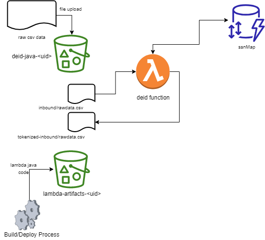

# Deidentifier S3 - Lambda POC

The project source includes function code and supporting resources:

- `src/main` - The Java Lambda function that implements the deidentification logic.
- `src/test` - A unit test and helper classes (not currently in use - see below).
- `testdata` - Sample rawdata.csv file containing fake user info (including SSNs)
- `template.yml` - The CFT that creates the de-id application.
- `build.gradle` - A Gradle build file.
- `1-create-bucket.sh`, `2-deploy.sh`, etc. - Shell scripts that use the AWS CLI to deploy and manage the DE-ID application.

Use the following instructions to deploy the deidentification POC app.

# Requirements
- [Java 8 runtime environment (SE JRE)](https://www.oracle.com/java/technologies/javase-downloads.html)
- [Gradle 5](https://gradle.org/releases/) 
- The Bash shell
- [The AWS CLI](https://docs.aws.amazon.com/cli/latest/userguide/cli-chap-install.html) v1.17 or newer.

# Setup
Download or clone this repository.

    $ git clone https://github.com/leidosdaren/deindentification.git
    $ cd deidentification

To create a new bucket for DE-ID deployment artifacts, run `1-create-bucket.sh`.

    $ ./1-create-bucket.sh
    make_bucket: lambda-artifacts-a5e491dbb5b22e0d

To build a Lambda layer that contains the function's runtime dependencies, run `2-build-layer.sh`.

    $ ./2-build-layer.sh

# Deploy
To deploy the application, run `3-deploy.sh`.

    $ ./3-deploy.sh
    BUILD SUCCESSFUL in 1s
    Successfully packaged artifacts and wrote output template to file out.yml.
    Waiting for changeset to be created..
    Successfully created/updated stack - deid-java

This script uses AWS CloudFormation to deploy the Lambda functions and an IAM role. If the AWS CloudFormation stack that contains the resources already exists, the script updates it with any changes to the template or function code.

# Test
This Lambda function is triggered by dropping a data file in the inbound/ directory of the `deid-java-bucket-<random_uuid>` S3 bucket.

When the deidentification process is complete, the `deid-java-bucket-<random_uuid>` bucket that was created in step 3 will contain
the de-id'ed version of the file in the `deid-java-bucket-<random_uuid>/tokenized-inbound` folder.

# Cleanup
To delete the application, run `6-cleanup.sh`.

    $ ./4-cleanup.sh
